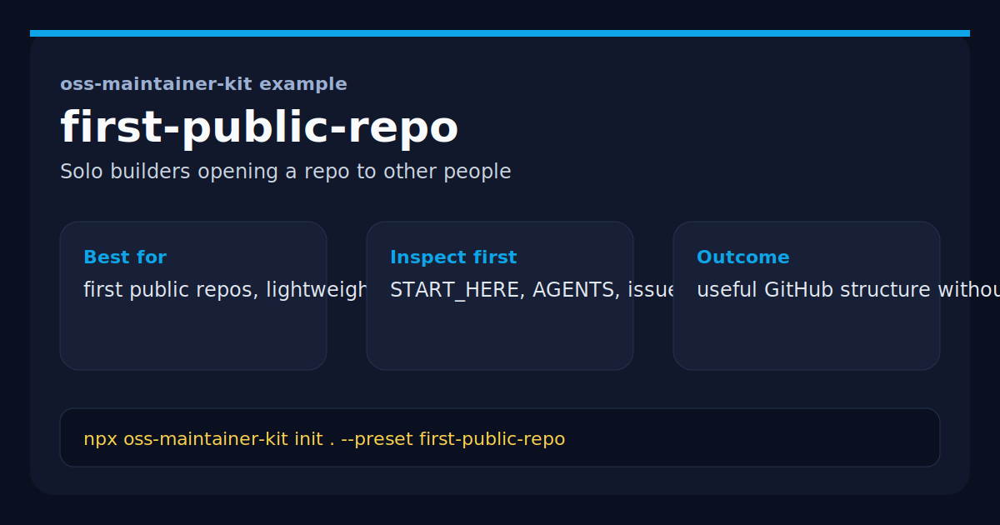

# OSS Maintainer Kit Example



This repository shows what the `first-public-repo` preset from [`oss-maintainer-kit`](https://github.com/BlakeHampson/oss-maintainer-kit) looks like after scaffolding.

It was generated with:

```bash
npx oss-maintainer-kit init . \
  --repo-name oss-maintainer-kit-example \
  --maintainer "Blake Hampson" \
  --preset first-public-repo
```

## Why this repo exists

This is not a production app. It is a concrete example for someone who wants to inspect the starter files before using the kit on a real repo.

If GitHub process still feels fuzzy, this is the easiest example to start with.

## Quick scan

- `docs/START_HERE.md`: plain-English orientation for the repo owner
- `AGENTS.md`: tells AI reviewers and contributors what matters here
- `.github/PULL_REQUEST_TEMPLATE.md`: prompts contributors for context and checks
- `.github/ISSUE_TEMPLATE/*`: turns vague bug reports into actionable input

## What this preset is trying to optimize

- enough structure to make a repo understandable
- no release-prep workflow by default
- a setup that still makes sense if you are the only maintainer

## Related project

- Main tool: <https://github.com/BlakeHampson/oss-maintainer-kit>
- npm package: <https://www.npmjs.com/package/oss-maintainer-kit>
